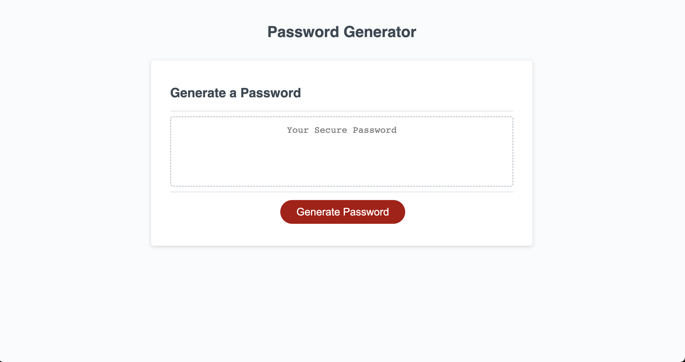

# challenge-3

Bootcamp module 3 challenge

## Description

The purpose of this project was to use JavaScript to generate a random password for the user based on their password criteria. The user selects whether their password should include lowercase letters, uppercase letters, numbers, and special characters. The user also provides a desired password length. The application then generates and displays a random password fitting the selected criteria.

[Link to application](https://jboyce313.github.io/challenge-3/)
